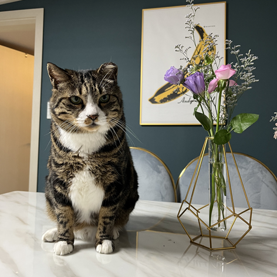
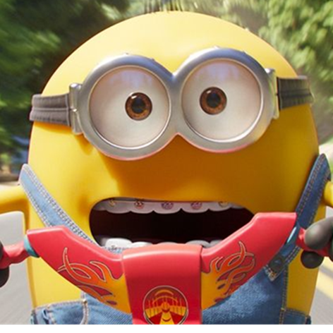
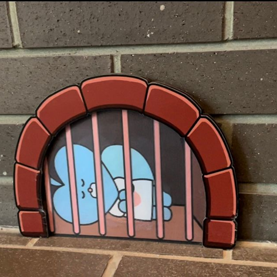
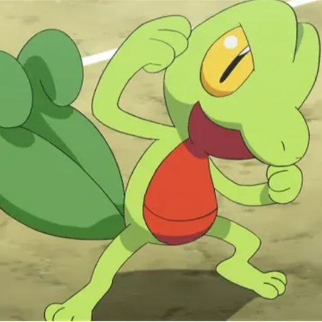

# The Arctic

> Play The Arctic, Save The Arctic

### 멀게만 느껴지는 환경 문제, The Arctic을 플레이하고 함께 해결해봐요!

 

## 😀 팀원 소개

|  |  |  |  |  |
| :----------------------------------------------------------: | :----------------------------------------------------------: | :----------------------------------------------------------: | :----------------------------------------------------------: | :----------------------------------------------------------: |
|                            김수미                            |                            마유선                            |                            박지호                            |                            조미곤                            |                            한상우                            |

 

## 🛠 기술 스택

##### Develop

  

 

##### Infra

 

##### Communitcation Tool

 

##### Development Tool

 

[※ 상세]()

 

## 💡 기획

- 문제
  - 북극의 온난화
    - 온실 가스에 의한 기후 변화로 인해 지속적인 빙하 면적 감소 현상 발생
  - 북극의 생태계 파괴
    - 플라스틱, 비닐 등 분해가 어려운 쓰레기들이 무분별하게 버려져 위협 받는 북극의 생태계
- 원인
  - 온실가스(이산화탄소 등)의 배출
  - 무분별한 해양 쓰레기
  - 모두 인간이 저지른 것이라는 결론
  - 특히 1인 가구의 비중과 그들의 일회용품, 플라스틱 이용량은 폭발적으로 증가하고 있음
- 해결 방안
  - 인간이 스스로 경각심을 가지고 이산화탄소 배출량 및 쓰레기를 감소시키기 위한 노력을 기울여야 함
  - 컴퓨터 게임과 인터넷 검색이 주된 취미인 1인 가구들에게 싱글 플레이 게임을 통해 환경 문제에 더욱 친숙하게 다가갈 수 있도록 함
- 기대 효과

  - 게임을 통해 재난 문제를 인식한 사람들이 자연친화적인 생활 양식을 갖도록 촉진시키고자 함

 

##  산출물

* [아키텍처](https://cheddar-knee-742.notion.site/b0f286bf4f1d439a8da9873963dd7cf3)

 

##  서비스

* [포팅 매뉴얼](/exec/A607_배포_문서/A607_빌드및배포가이드.md)

 

##  기능 설명

- [기능 설명_PDF](/exec/A607_시연시나리오.pdf)
- [기능 설명_Notion](https://cheddar-knee-742.notion.site/d44e009efdf149c1a6021c41840b4dea)

 

## 🖥 역할 분담

|     이름     | 역할                                                         |
| :----------: | ------------------------------------------------------------ |
| 김수미   | - Map1 제작  - Game1 제작 - NPC, Change Scene, Item Regenerate, Volume Control 구현 - PPT 제작 - 최종 발표  |
| 마유선   | - Map3 제작 - Game3 제작 - Animation 총괄 - IP를 활용한 사용자별 게임 상태 저장 - DB 연결  |
| 조미곤   | - Map2 제작 - Map 디자인 총괄 - Game2 제작 - Minimap, Radar 구현 - 중간 발표 |
| 박지호   | - Map3, Ending Map 제작 - Game2 제작 - 시네마틱 제작 총괄 - AWS EC2 환경 내 프로젝트 배포 - UCC 제작  |
| 한상우   | - Map1 제작 - Game1 제작 - NPC, Save Point, Respawn, Sound Effect 구현 - Unity 오브젝트 간 상호작용 총괄 - 게임 시연 |

 

